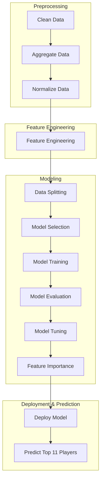

```mermaid
graph TD
A[Clean Data] --> B[Aggregate Data]
B --> C[Normalize Data]
C --> D[Feature Engineering]
D --> E[Data Splitting]
E --> F[Model Selection]
F --> G[Model Training]
G --> H[Model Evaluation]
H --> I[Model Tuning]
I --> J[Feature Importance]
J --> K[Deploy Model]
K --> L[Predict Top 11 Players]

subgraph Preprocessing
A
B
C
end

subgraph Feature Engineering
D
end

subgraph Modeling
E
F
G
H
I
J
end

subgraph Deployment & Prediction
K
L
end

```
